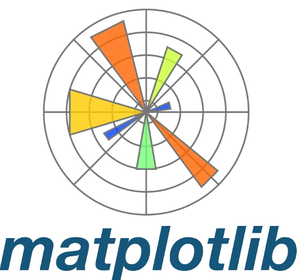

# **INF-604: Data Analysis**

<a href="https://hassothea.github.io/">HAS Sothea, PhD</a>
2025-01-17

- [**Introduction**](#introduction)
- [**Course Criteria**](#course-criteria)
  - [**Programming:**](#programming)
- [**Course progress**](#course-progress)
- [**Midterms, Exams and Projects**](#midterms-exams-and-projects)
  - [**Midterm & Exam**](#midterm--exam)
  - [**Project:**](#project)
- [**Resources and Further Reading**](#resources-and-further-reading)

# **Introduction**

Welcome to the **Data Analysis Course**!

Embark on an exciting journey into the world of data with our
comprehensive **Data Analysis course**. This course covers everything
you need to know to transform raw data into meaningful insights.

------------------------------------------------------------------------

📋 **Course Highlights:**

- **Introduction to Data Analysis:** Dive into the world of data
  analysis, its significance, and real-world applications.
- **Data Types and Descriptive Statistics:** Learn to identify different
  data types and understand measures of central tendency, dispersion,
  and summary statistics.
- **Data Collection and Cleaning:** Master the art of gathering data
  from various sources, handling missing data, and cleaning datasets for
  accurate analysis.
- **Data Visualization Basics:** Explore essential tools and techniques
  to present data effectively and make impactful visualizations.
- **Exploratory Data Analysis (EDA):** Develop skills to identify
  trends, patterns, and anomalies in datasets, guiding deeper analysis.
- **Practical Labs for Data Analysis:** Gain hands-on experience with
  Python and/or R to perform data analysis and create comprehensive
  visualizations.

By the end of this course, you’ll have a solid foundation in data
analysis, empowering you to make data-driven decisions and insights.
Whether you’re a beginner or looking to enhance your skills, this course
has something for everyone.

------------------------------------------------------------------------

# **Course Criteria**

| **`Criteria`**                                | **`Percentage`** |
|:----------------------------------------------|:----------------:|
| Attendance                                    |       10%        |
| Participation & quiz                          |       30%        |
| Midterm Exam                                  |       30%        |
| Final Project & Presentation / Practical labs |       30%        |

## **Programming:**

> You are free you use your favorite programming language
> <a href="https://www.python.org/" target="_blank"> src="./Slides/img/python.png" style="position: relative; bottom: 0px"
> width="30" /></a> `Python` or
> <a href="https://www.r-project.org/" target="_blank"> src="./Slides/img/R_logo.png" style="position: relative; bottom: 0px"
> width="30" /></a> .

## `Python`

- <a href="https://docs.jupyter.org/en/latest/" target="_blank"> Jupyter Notebook</a>
- 
- <a href="https://matplotlib.org/" target="_blank"> Matplotlib</a>
- <a href="https://seaborn.pydata.org/" target="_blank"> Seaborn</a>

## `R`

- <a href="https://quarto.org/" target="_blank">
  Rmarkdown/Quarto</a>
- <a href="https://ggplot2.tidyverse.org/" target="_blank"> Posit cloud</a>
- <a href="https://ggplot2.tidyverse.org/" target="_blank"> Ggplot2</a>
- <a href="https://www.tidyverse.org/" target="_blank"> Tidyverse</a>

------------------------------------------------------------------------

# **Course progress**

**Note**: The following table of contents will be progressively updated
according to the course advancement.

| Topic | Lab | Solution | Remark |
|:---|:--:|:--:|:--:|
| <a
href="https://hassothea.github.io/Data_Analysis_AUPP/Slides/Intro_Data_Analysis.html"
target="_blank">Introduction to Data Analysis</a> | Lab1 | Solution1 | …Loading |

# **Midterms, Exams and Projects**

In this section, you will find all the information related to the
midterms, exams and projects including instructions, starting dates and
the deadlines.

## **Midterm & Exam**

- A possible `midterm` date: `...Loading`.

## **Project:**

- Deadline for the report: `...Loading`.
- Where to submit: `Canvas`
- Your report should be in (your favorite) **PDF** format and include
  the following criteria:
  - **Members’ names & contributions**.
    - Clearly state each member’s contribution to the report.
    - For example:
      - **Luffy**: Introduction, Data Preprocessing
      - **Gojo**: Exploratory Data Analysis, Model Development
      - **Naruto**: Results and Evaluation, Conclusion
  - **Introduction**:
    - Clearly state the objectives and purpose of the analysis.
    - Provide a brief overview of the dataset used.
  - **Data Preprocessing**:
    - Detail steps taken to clean and preprocess the data.
    - Explain handling of missing values and outliers.
    - Describe any feature engineering techniques applied.
  - **Exploratory Data Analysis (EDA)**:
    - Include visualizations (charts, graphs) and descriptive
      statistics.
    - Identify key patterns, trends, and anomalies in the data.
  - **Model Development**:
    - Explain the choice of model(s) and rationale behind it.
    - Provide details on model training, validation, and testing
      processes.
    - Include any hyperparameter tuning and model optimization steps.
  - **Results and Evaluation**:
    - Present model performance metrics (e.g., accuracy, precision,
      recall, F1-score, RMSE).
    - Compare performance across different models if multiple were used.
    - Highlight any insights or conclusions drawn from the model’s
      predictions.
  - **Conclusion**:
    - Summarize key findings and their implications.
    - Discuss any limitations of the analysis.
    - Suggest potential areas for future research or improvement.
  - **References**:
    - Cite all sources of data and any external libraries or tools used.
    - Include academic references for any theoretical concepts or
      methods applied.
  - **Appendix (Optional)**:
    - Provide additional figures, tables, or code snippets that support
      the analysis.
- **Presentation**:
  - A possible dates: `...Loading`.

------------------------------------------------------------------------

# **Resources and Further Reading**

Here, you will find additional resources, including books, research
papers, and online courses, to further your understanding of **Data
Analysis**.

📚 You will find these books/links helpful…

- <a
  href="https://content.e-bookshelf.de/media/reading/L-11307411-11b3dd5f67.pdf"
  target="_blank">A General Introduction to Data Analytics, Moreira et
  al. 2019</a>

- <a
  href="https://www.advisory21.com.mt/wp-content/uploads/2023/05/Data-Science-for-Business.pdf"
  target="_blank">Data Sience for Business, Foster Provost &amp; Tom
  Fawcett</a>

- <a
  href="https://github.com/PacktPublishing/Exploratory-Data-Analysis-with-Python-Cookbook?tab=readme-ov-file"
  target="_blank">Exploratory-Data-Analysis-with-Python-Cookbook</a>

- <a href="https://haralick.org/DV/Handbook_of_Data_Visualization.pdf"
  target="_blank">Handbook of Data Visualization, Chen et al.</a>

- <a href="https://wesmckinney.com/book/" target="_blank">Python for Data
  Analysis, Wes M.</a>

- <a href="https://bookdown.org/rdpeng/exdata/"
  target="_blank">Exploratory Data Analysis with R, Roger D. Peng</a>

- <a
  href="https://batrachos.com/sites/default/files/pictures/Books/Wickham_Grolemund_2017_R%20for%20Data%20Science.pdf"
  target="_blank">R for Data Science, Hadley W. and Garrett G.</a>

------------------------------------------------------------------------
